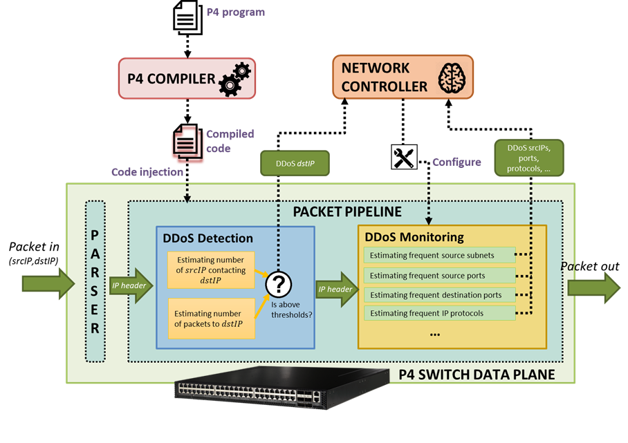

Sketch-based DDoS monitoring
======

DDoS traffic monitoring can be performed directly at the data plane level of the white box thanks to the use of big data streaming sketch memory structures. 
The sketch structures (count-min sketch, bloom filters) provide memory-efficient collection of summarised traffic statistics. They process packets at full wire speed, performing a set of actions for every packet. Moreover, all processed packets can contribute to traffic statistics without any performance penalty. 

This implementation should be used togather with DDoS detection solution.



When the network controller is notified of the DDoS attack target at a specific destination IP address, the controller can activate one or more DDoS monitoring algorithms which provide more detailed DDoS traffic statistics:
•	The total traffic (packets and bytes) towards the DDoS target.
•	The most frequent source IP subnets (i.e. with an IPv4 /16 prefix) originating the attack.
•	The most frequent source TCP/UDP ports - specific port numbers can suggest the use of DDoS amplification techniques based on vulnerable public network services (e.g., DNS, NTP, SNMP).
•	The most frequent destination TCP/UDP ports which tell what service is under attack (e.g., a web portal).
•	The IP protocols used (whether it is a UDP- or TCP-based DDoS attack).
•	The most frequent packet lengths (amplification attacks tend to use big packets).


The DDoS monitoring implementation and testing was done within the GEANT Data Plane Programmibilty activity:

https://wiki.geant.org/display/NETDEV/DPP
All INT code is under the Apache 2.0 licence.


p4app
-----

p4app is a tool that which can be used to build, run, debug, and test P4 programs. The philosophy behind p4app is "easy things should be easy" - p4app is designed to make small, simple P4 programs easy to write and easy to share with others.


Installation
------------

1. Install [docker](https://docs.docker.com/engine/installation/) if you don't already have it.

2. If you want, put the `p4app` script somewhere in your path. For example:

    ```
    cp p4app /usr/local/bin
    ```

For more information about p4app please visit: https://github.com/p4lang/p4app


Usage
-----'

p4app runs p4app packages. p4app packages are just directories with a `.p4app`
extension - for example, if you wrote a router in P4, you might place it in
`router.p4app`. Inside the directory, you'd place your P4 program, any
supporting files, and a `p4app.json` file that tells p4app how to run it.

Here's how you can run it:

```
p4app run examples/ddos.p4app
```

And then run DDoS monitoring controller within mininet host H1 

```
cd  examples/ddos.p4app
python ddos_monitoring_controller.py
```

In order to test please start DDoS traffic generator script:
```
cd examples/ddos.p4app
./xterm_h1.sh
python /tmp/ddos_send.py
```


Contact
---------
int-discuss@lists.geant.org


